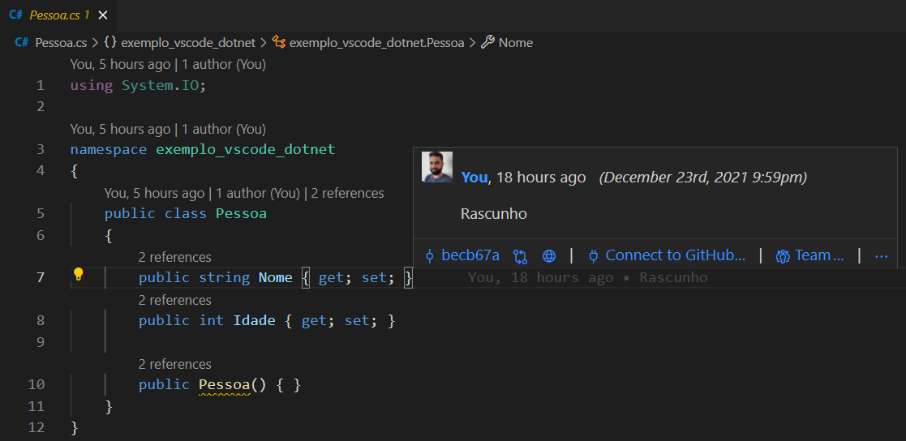

# Extensões para desenvolvimento .NET no VSCodeverso

## INTRODUÇÃO
 
O Visual Studio Code (VS Code para os íntimos) é um editor open source que dá suporte a diferentes linguagens de programação, essa poderosa ferramenta é muito mais leve que uma IDE (ambiente de desenvolvimento integrado) mas conta com extensões que facilitam a produtividade e desenvolvimento. Neste artigo vou compartilhar algumas extensões que utilizo no meu "VSCodeverso" de desenvolvimento de aplicações .NET

## C# (OmniSharp)
 [ms-dotnettools.csharp](https://marketplace.visualstudio.com/items?itemName=ms-dotnettools.csharp)

A principal extensão para para aplicações .NET, o VS Code por padrão já recomenda esta extensão assim que você inicia um projeto C#. Algumas das funcionalidades são:

### Debug
Suporte à depuração para .NET

### IntelliSense
O IntelliSense simplesmente facilita a escrita de código, você pode pressionar Ctrl + Espaço a qualquer lugar do seu código para obter sugestões específicas e snippets para C# por exemplo.

### CodeLens
Outro recurso interessante é a capacidade de ver o número de referências a um método. Você pode visualizar de forma rápida onde seu método/propriedade está sendo utilizado.

### Correções
Em alguns momentos você vai ver uma pequena lâmpada, ela traz sugestões ou correções para melhorar a qualidade do seu código.

## C# Extensions

[jchannon.csharpextensions](https://marketplace.visualstudio.com/items?itemName=jchannon.csharpextensions)

Essa extensão é um adianto de trabalho na hora de criar classes e interfaces, utilizando esse recurso você não precisa se preocupar com a criação da estrutura de namespaces das classes a extensão realiza essa tarefa para você.

## SQL Server (mssql)

[ms-mssql](https://marketplace.visualstudio.com/items?itemName=ms-mssql.mssql)

Uma extensão para facilitar o trabalho com Microsoft SQL Server, isso mesmo você usar o VS Code para facilitar seu trabalho com SQL Server.
As funcionalidades que eu mais utilizo são:

 - Conecção com Microsoft SQL Server, Banco de Dados SQL do Azure. 
 - Escrever script T-SQL com IntelliSense, colorização de sintaxe, validações de erro T-SQL.
 - Executar seus scripts e visualiza os resultados em uma tabela simples de usar.

## GitLens Explorer

[eamodio.gitlens](https://marketplace.visualstudio.com/items?itemName=eamodio.gitlens)

GitLens oferece a funcionalidade de ver quem e quando modificou o código em um arquivo. A extensão fornece vários recursos do git, é uma opção para quem não utiliza a linha de comando Git.

 ## Personalização 
O VS Code conta com muitas opções para personalização,sim sua produtividade pode ser afetada de acordo com as cores das suas "letrinhas", eu por exemplo tenho dificuldade com temas mais claros, que com o passar do tempo incomoda minha visão.

## Temas
[vscodethemes.com](https://vscodethemes.com/)

Como esse ponto é bem particular de cada desenvolvedor vou deixar um link com alguns temas e aí você escolhe o "sabor" que mais te agrada :)

## Ícones

[Material Icon Theme](https://marketplace.visualstudio.com/items?itemName=PKief.material-icon-theme)

O Material Icon Theme conta com uma variedade de ícones independente da linguagem/framework utilizado. Ele facilita a visualização dos arquivos e pastas do seu projeto

## Conclusão

Existe um ["multiverso"](https://marketplace.visualstudio.com/VSCode) de extensões e voce pode também criar a sua própria extensão [documentação oficial](https://code.visualstudio.com/api), de acordo com suas preferências o seu VS Code toma um formato diferente para facilitar o seu trabalho. Nesse artigo apresentei as extensões que mais utilizo no meu VS Code, comenta aí quais extensões você mais utiliza.
